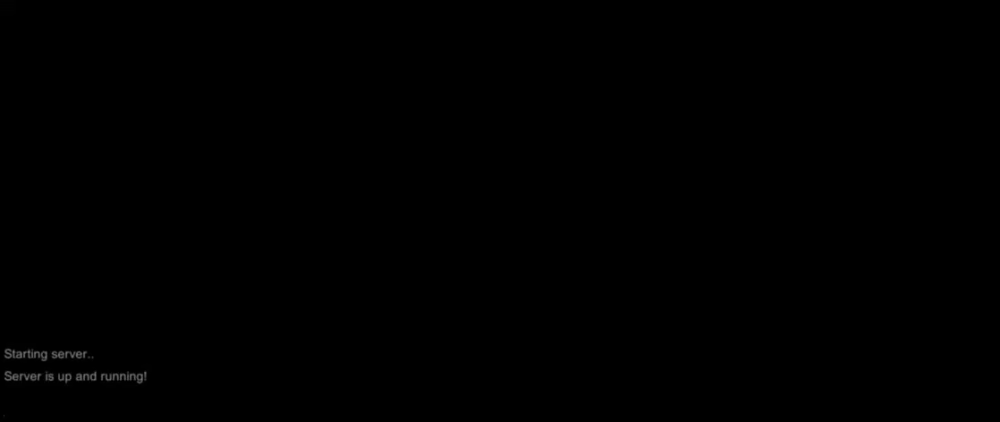

The downside to using this project is the server will have Unity overhead, other than that, everything seems to work flawlessly.
  
Read [this](https://github.com/valkyrienyanko/Prototype/blob/master/.github/CONTRIBUTING.md) if you're interested in contributing.

